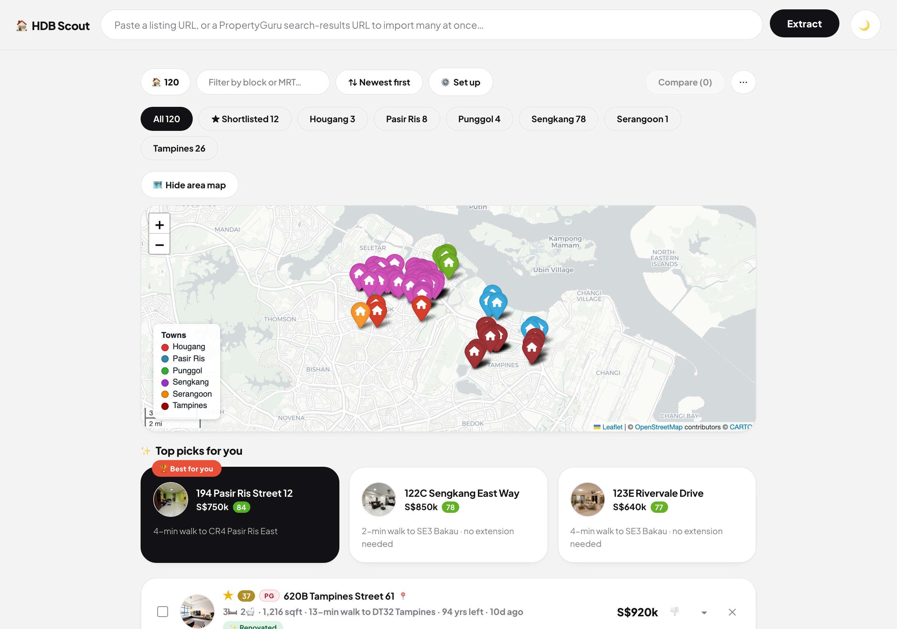
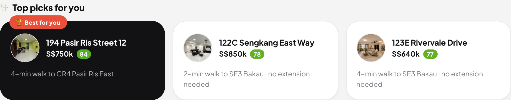
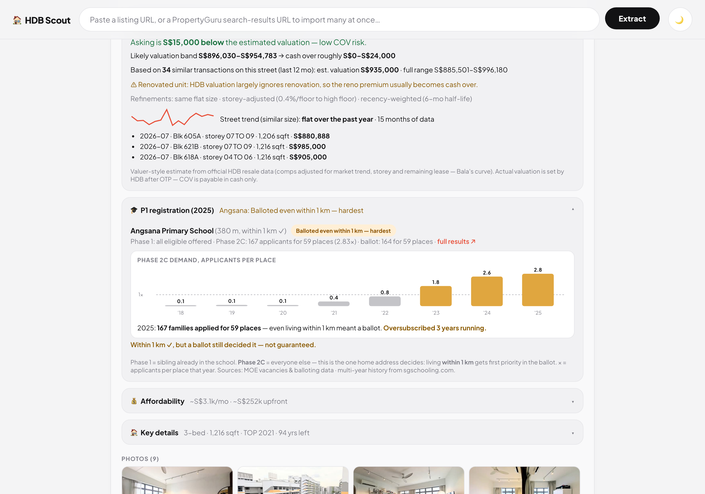
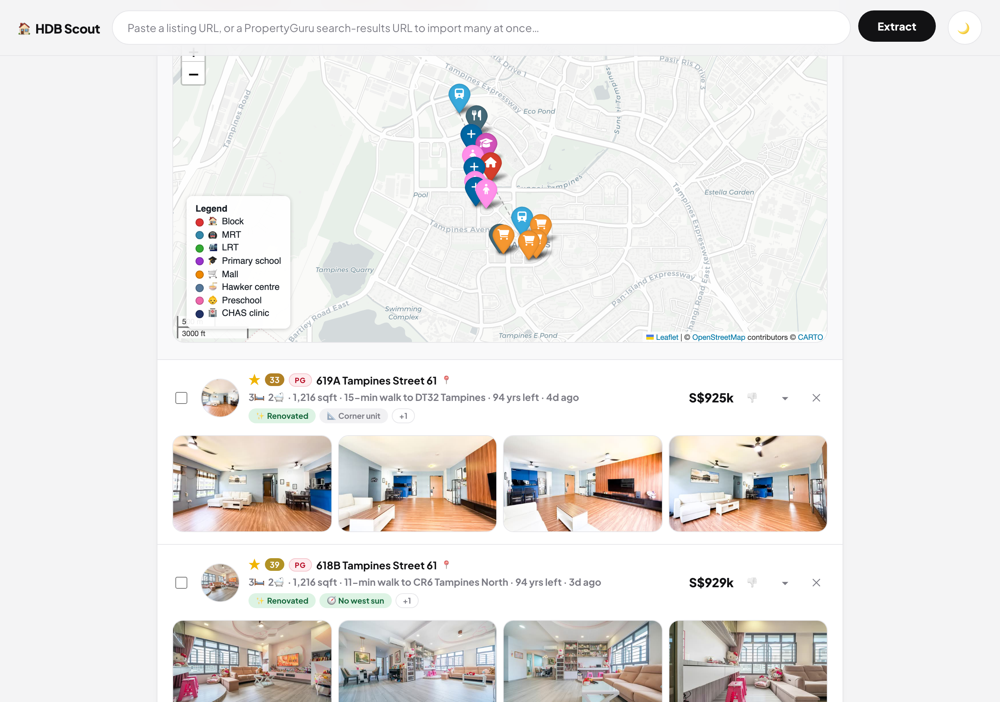
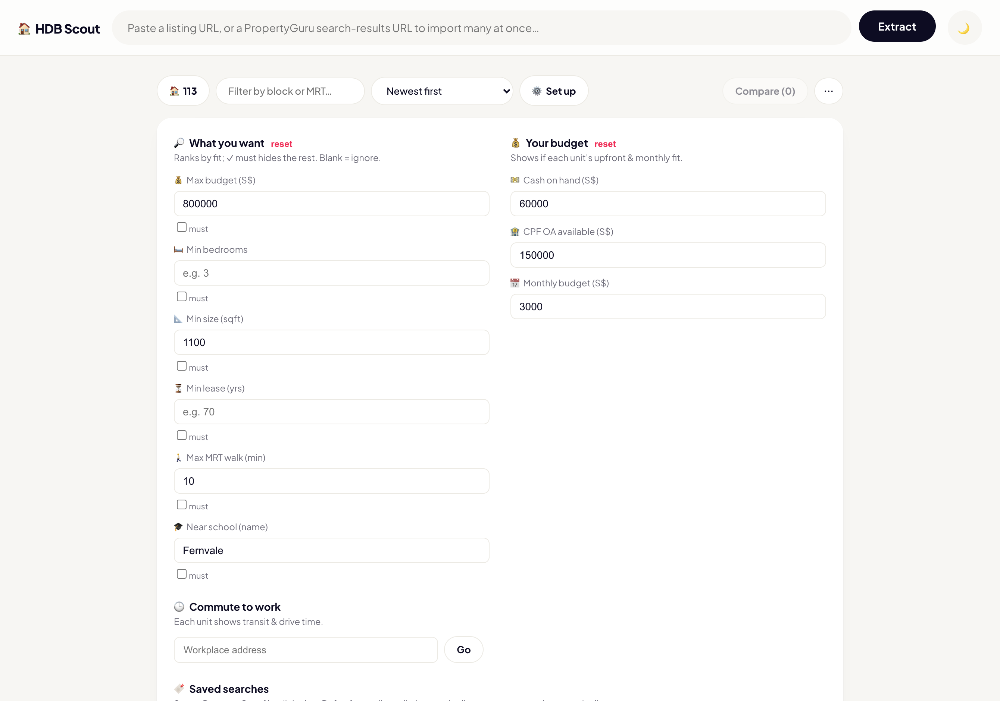
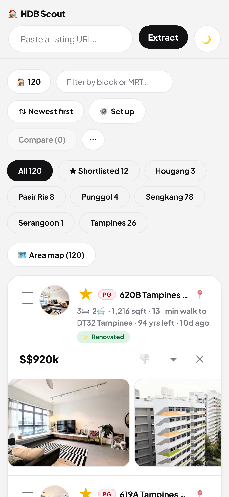
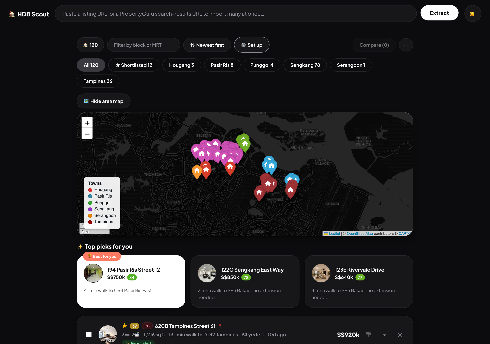

# 🏠 HDB Scout

**A free, local-first house-hunting copilot for Singapore HDB resale.**

Paste a PropertyGuru or SRX listing link — or a whole filtered search — and HDB
Scout turns the "wall of listings" into a decision: photos, prices, $/psf,
lease left, MRT walk, primary-school odds, estimated COV, affordability against
*your* budget, and a map of everything that matters. All running on **your own
computer**; your shortlist, notes, and finances never leave your machine.



> ⚠️ Community project, not affiliated with PropertyGuru, SRX, HDB, MOE, or any
> government agency. For personal, non-commercial research use.

---

## See it work

### One paste → your whole search, ranked
Import an entire filtered PropertyGuru search. Every listing arrives with a
photo carousel of its first 4 photos, right in the list — no clicking in to
see the place; town tabs, pagination and a colour-coded map show your search
geography at a glance. Promoted/paid-placement cards (Turbo, Spotlight,
Featured…) are skipped automatically — you only see organic listings.

### ✨ Top picks, with reasons
Tell it what you want and it names the best few — in plain English, not scores
you have to decode.



### 💵 Is it overpriced? 🎓 Will my kid get in?
The two questions that actually decide a purchase, answered per listing from
official data — and every answer **leads with one plain-English line**, with
the numbers a tap away: **potential COV**, estimated the way a valuer actually
works (comps adjusted for storey and remaining lease via Bala's curve,
recency-weighted, with a likely-valuation band), and the **P1 registration
outlook** — this year's balloting for nearby schools combined with *this
flat's* distance, plus an in-app chart of each school's Phase 2C demand
across the years so you can see a school getting harder before it becomes a
problem. Balloting data refreshes automatically when each new year's results
are published. And what it all costs you monthly and upfront, against your
own budget.



### 🗺️ Everything that matters, mapped
Per listing: MRT/LRT, primary schools, malls, hawker centres, preschools and
CHAS clinics — with walking distances. Click any pin to jump to the listing.



### 🔎 Tell it what you want — once
Plain-language criteria, your budget, your commute, and saved searches you can
rename, refresh anytime (duplicates removed automatically), and reuse per
client or area.



### 📱 On your phone, in your theme
Run it on your computer, browse it from your phone on the sofa — carousels,
the sort sheet, and every card adapt to the screen. Dark by default; one tap
on the toggle switches to light, everywhere.

<p align="center">
  
  
</p>

---

## Who it's for

**🧑‍🤝‍🧑 Home buyers (self-help).** You're drowning in 100+ listings. Import your
whole filtered search in one paste, tell Scout what you want (budget, size,
lease, MRT walk, school), and it hides the no-gos, scores the rest, and names
its **Top Picks with plain-English reasons** — "cheapest of the lot · 4-min walk
to Buangkok · Fernvale Primary 290 m away". Then check what the block really is
(official HDB record), what similar units *actually transacted* for (potential
COV), and whether your cash + CPF covers it.

**🏢 Property agents (advise clients).** Import a client's search area once,
save it, and hit **Refresh** before each meeting to pull the latest listings
with duplicates auto-removed. Every listing carries the evidence you'd
otherwise assemble by hand — recent transacted comps with a trend line, P1
balloting history for nearby schools, block profile, price-drop tracking on
shortlisted units — and a one-tap **WhatsApp share** that sends a clean summary
(with the listing agent's contact) to your client.

## Features

- **Bulk import** — paste one listing URL or a whole search-results URL; every
  page is walked, de-duplicated, and loaded with photos in one go; promoted /
  paid-placement cards (Turbo, Spotlight, Featured…) are skipped automatically
- **Saved searches** — save a filter link per client/area, rename it anything
  you like, refresh anytime
- **What-you-want filters + fit score** — plain-language criteria; "must"
  checkboxes hide failures, the rest rank by fit (0–100)
- **Top Picks** — best 3 with reasons; 🏆 Best-for-you call; 👎 one-tap triage
- **💵 Potential COV** — valuer-style estimate from official resale
  transactions: same block → street, size-matched, then each comp individually
  adjusted for storey (premium fitted from the street's own data) and
  remaining lease (Bala's leasehold curve), recency-weighted toward the last
  6 months, outliers trimmed, with a likely-valuation band + street sparkline
- **🎓 P1 registration check** — MOE vacancies & balloting per nearby school,
  combined with *this flat's* radial distance: "within 1 km — the group that
  got places last year" — with a direct link to each school's official MOE
  results page
- **Affordability** — monthly mortgage + cash/CPF upfront vs your saved budget
- **🏢 Block profile** — official HDB record: built year, floors, units, MSCP
- **Maps** — per-listing (MRT/LRT, schools, malls, hawkers, preschools, CHAS
  clinics) and area overview colour-coded by town; Google Maps directions link
- **Photo carousel** — first 4 photos visible in the list for every listing,
  no click-through needed; larger hover preview of the hero shot on desktop
- **Tracking** — ★ shortlist tab, status (viewing/offered/rejected), private
  notes, price-change re-checks (single or whole shortlist)
- **Share to agent/client** — editable summary → copy or WhatsApp
- **Commute times**, dark mode (default), pagination, town tabs,
  mobile-friendly, CSV export

## Quick start

**macOS / Linux**

```bash
git clone <this-repo> hdb-scout && cd hdb-scout
python3 -m venv venv && source venv/bin/activate
pip install -r requirements.txt
playwright install chromium        # one-time; real Chrome is used if installed
python app.py                      # → http://127.0.0.1:5001
```

**Windows** (PowerShell or Command Prompt)

```bat
git clone <this-repo> hdb-scout && cd hdb-scout
python -m venv venv && venv\Scripts\activate
pip install -r requirements.txt
playwright install chromium
python app.py                      :: → http://127.0.0.1:5001
```

**Requirements:** Python 3.11+, Google Chrome recommended (falls back to
Playwright's bundled Chromium if Chrome isn't found). First import may show a
Cloudflare verification in the Chrome window that opens — click it once; the
browser profile remembers it. The app is pure Python + a browser automation
library, so it runs the same way on Windows, macOS, and Linux — no
platform-specific code.

**Optional — OneMap account** (free, [onemap.gov.sg](https://www.onemap.gov.sg)):
unlocks commute times, SRX geocoding, coordinate sanity-checks, and the
hawker-centre layer. Copy `secrets.json.example` → `secrets.json` and fill in
your credentials (or set `ONEMAP_EMAIL` / `ONEMAP_PASSWORD` env vars).
Everything else works without it.

**Phone access (Android & iOS):** the app itself only needs to run on a
computer — Windows or macOS both work. Your phone is just a browser client,
so any Android or iOS device on the same Wi-Fi (or anywhere, via a tunnel)
can use it, no app install needed. Double-click **`phone.command`** on macOS
or **`phone.bat`** on Windows (or run `python phone.py` on Linux) to serve the
app to your phone: on the same Wi-Fi via your LAN IP, or anywhere via a free
Cloudflare quick tunnel if you have [`cloudflared`](https://github.com/cloudflare/cloudflared)
installed. The UI itself is fully responsive — carousels, sort sheet, and
listing cards all adapt to a phone screen.

## How it works

- Listing pages are rendered in a real Chrome window (Playwright with a
  persistent profile) and parsed from each site's embedded structured data —
  not brittle CSS selectors.
- Public data comes from official sources: HDB resale transactions & property
  info and CHAS clinics/preschools (data.gov.sg), P1 balloting (moe.gov.sg —
  each school links straight to its own official results page), geocoding/
  routing (OneMap). Downloads are cached locally and refreshed periodically.
- Everything is stored in flat local files: `results.csv` (your listings,
  notes, shortlist), `saved_searches.json`, and dataset caches. Delete them
  anytime; `.gitignore` keeps them out of the repo.

## Honest limitations

- Scraping listing sites for personal research sits in a grey zone of their
  terms of service. The app paces itself and keeps volumes low — keep it that
  way. Don't run it as a hosted service for others; each user should run
  their own copy.
- COV and affordability figures are **estimates for orientation, not advice**.
  Actual valuation is determined by HDB after OTP; consult professionals.
- P1 distance bands are approximated point-to-point; MOE/SLA measure
  official distances differently at the margins.
- One Ethnic Integration Policy (EIP) caveat: block-level ethnic quotas can
  make a specific flat unbuyable for a specific buyer — check HDB's e-service
  before making an offer.

## Contributing

Issues and PRs welcome — parser fixes when the sites change markup, new data
sources, UI polish, and localisation are all great first contributions. Keep
the project's principles: local-first, no accounts, no tracking, gentle
scraping, official data where possible.

## License

MIT — see [LICENSE](LICENSE).
